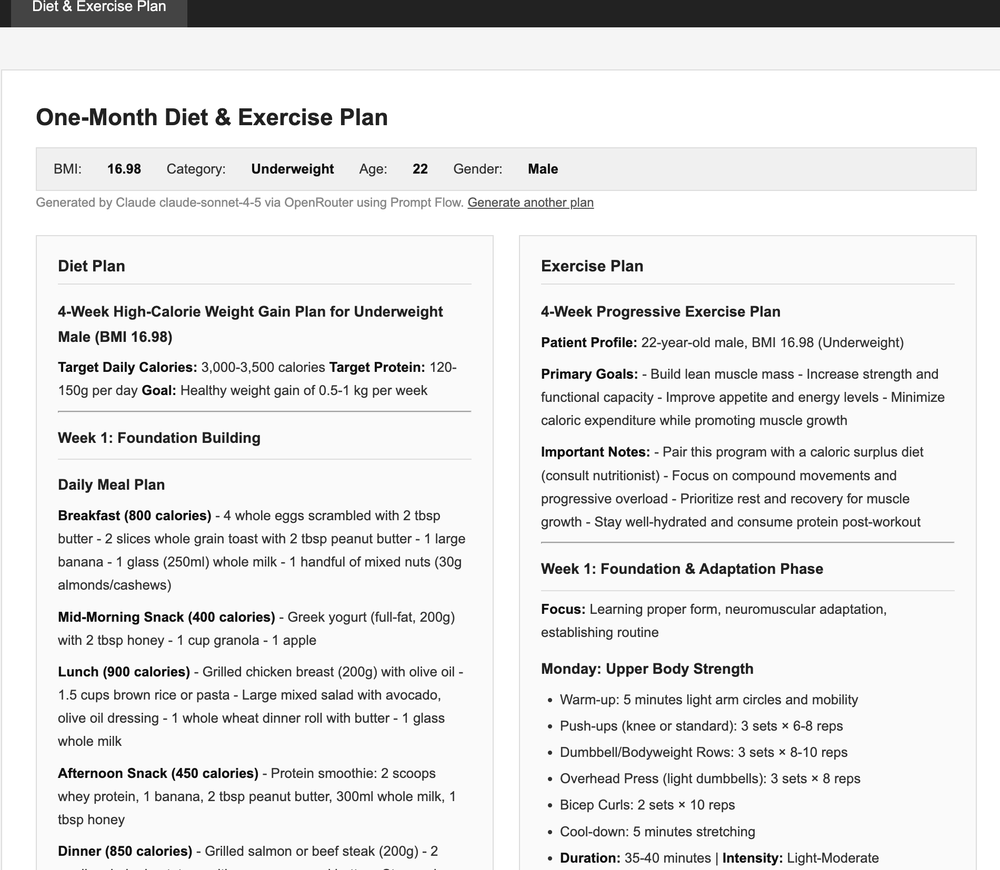
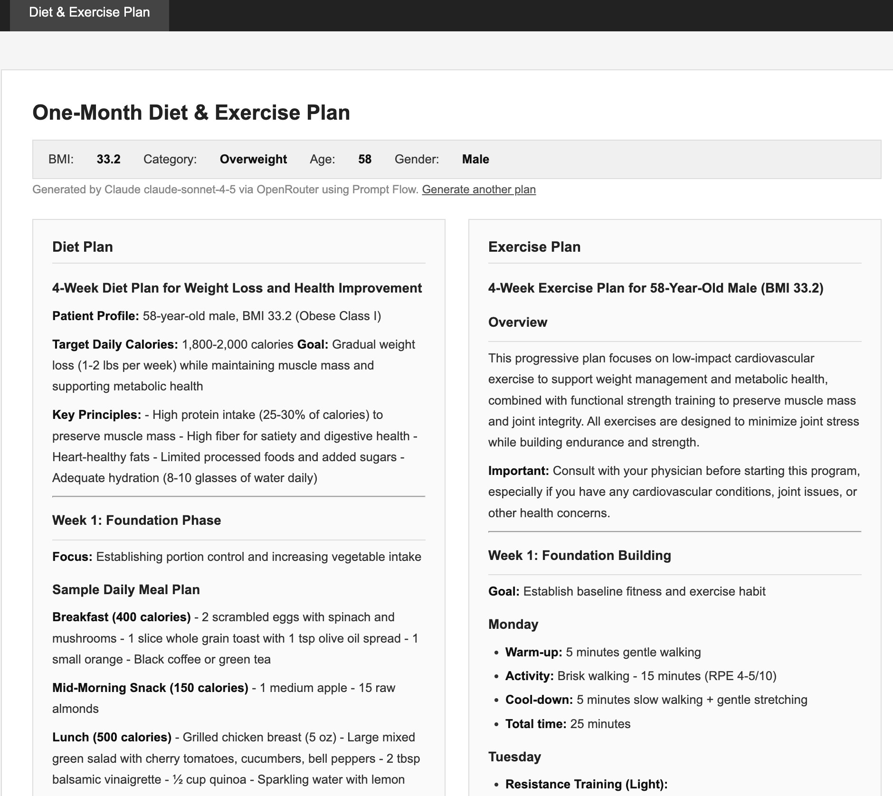

# W13A3 – BMI Calculator, Appointment Booking & AI Diet/Exercise Planner

A Django web application with three modules:

1. **BMI Calculator** — computes BMI from weight (kg) and height (cm), classifies as Underweight / Normal / Overweight.
2. **Book an Appointment** — students schedule meetings with lecturers during working hours (Mon–Fri 09:00–17:00). Bookings stored in `bookings.json`.
3. **Diet & Exercise Plan** — AI-generated one-month personalised diet and exercise plan based on BMI, age, and gender, powered by **Claude claude-sonnet-4-5** via **OpenRouter**, orchestrated with **Microsoft Prompt Flow**.

## GitHub

https://github.com/tomieNZ/PSE

## Setup

```bash
pip install -r requirements.txt
```

Create a `.env` file in `W13A3/` with your OpenRouter API key:

```
OPENROUTER_API_KEY=sk-or-v1-xxxxxxxxxxxxxx
```

Then run:

```bash
python manage.py runserver
```

Open http://127.0.0.1:8000 in your browser.

## How the AI Plan is Generated

The system uses **Microsoft Prompt Flow** to orchestrate a 4-node pipeline:

```
inputs (weight, height, age, gender)
    │
    ▼
[parse_input]  ── calculates BMI & category (pure Python, no LLM)
    │
    ├──────────────────────────────┐
    ▼                              ▼
[generate_diet]            [generate_exercise]
  Call Claude via OpenRouter  Call Claude via OpenRouter
  (parallel)                  (parallel)
    │                              │
    └──────────────┬───────────────┘
                   ▼
            [combine_plans]
                   │
                   ▼
        diet_plan + exercise_plan (markdown)
```

Both LLM nodes call `anthropic/claude-sonnet-4-5` through OpenRouter. The prompts are tailored to the patient's BMI category, age, and gender. Django renders the markdown output as HTML.

## Scenario Results

### Scenario 1 — Young, Underweight Person

| Field   | Value         |
|---------|---------------|
| Weight  | 55 kg         |
| Height  | 180 cm        |
| Age     | 22            |
| Gender  | Male          |
| BMI     | 16.98         |
| Category| Underweight   |

**How the plan was generated:**
Claude received a profile indicating a young underweight male with BMI 16.98. The diet plan focused on **high-calorie, protein-rich meals** (e.g. peanut butter, whole milk, eggs, legumes, lean meats) with 3 main meals and 2–3 calorie-dense snacks per day to support healthy weight gain. The exercise plan emphasised **progressive resistance/strength training** (3–4 days/week) with moderate cardio to build muscle mass safely without burning excess calories.



---

### Scenario 2 — Older, Overweight Person

| Field   | Value         |
|---------|---------------|
| Weight  | 85 kg         |
| Height  | 160 cm        |
| Age     | 58            |
| Gender  | Female        |
| BMI     | 33.20         |
| Category| Overweight    |

**How the plan was generated:**
Claude received a profile of an older overweight female with BMI 33.2. The diet plan focused on **low-calorie, nutrient-dense meals** with portion control (vegetables, lean protein, wholegrains, reduced refined carbs and sugar) to support gradual, sustainable weight loss. The exercise plan prioritised **low-impact cardio** (walking, swimming, cycling) and light resistance training to protect joints, improve cardiovascular health, and maintain muscle mass appropriate for her age.



---

## Project Structure

```
W13A3/
├── manage.py
├── requirements.txt
├── .env                        # OPENROUTER_API_KEY (not committed)
├── bookings.json               # appointment storage
├── flows/
│   └── diet_exercise_plan/
│       ├── flow.dag.yaml       # Prompt Flow DAG definition
│       ├── parse_input.py      # Node 1: compute BMI
│       ├── generate_diet.py    # Node 2: call Claude for diet plan
│       ├── generate_exercise.py # Node 3: call Claude for exercise plan
│       └── combine_plans.py    # Node 4: merge results
├── bmi_project/                # Django project settings & URLs
└── bmi/
    ├── views.py                # all views incl. plan_view
    ├── urls.py
    └── templates/
        ├── base.html           # shared nav and CSS
        ├── bmi.html            # BMI calculator
        ├── appointment.html    # booking form + listing
        ├── plan_form.html      # plan input form
        └── plan_result.html    # AI-generated plan display
```
