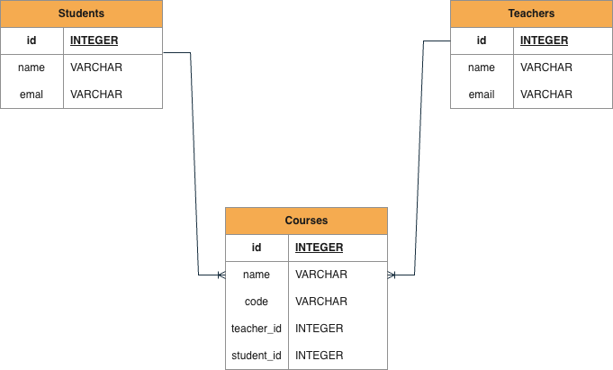

# YooBee MSE802 Week3 - Activity4


## Project Overview

An Object-Oriented Programming (OOP) based database management system using SQLite to manage student, teacher, and course information. This project demonstrates building a database application with Python and SQLite.

## Objectives

- Design and manage a database using OOP principles
- Display the number of students enrolled in MSE800 course
- List all teachers teaching MSE802 course

## Database Design

This project uses a three-table design: **Students**, **Teachers**, and **Courses**. The Courses table serves as both course information storage and a bridge table for student-course-teacher relationships.



### Table Structure

#### Students

| Field Name | Data Type | Constraints | Description |
|------------|-----------|-------------|-------------|
| id | INTEGER | PRIMARY KEY AUTOINCREMENT | Unique identifier |
| name | TEXT | NOT NULL | Student full name |
| email | TEXT | UNIQUE NOT NULL | Student email address |

#### Teachers

| Field Name | Data Type | Constraints | Description |
|------------|-----------|-------------|-------------|
| id | INTEGER | PRIMARY KEY AUTOINCREMENT | Unique identifier |
| name | TEXT | NOT NULL | Teacher full name |
| email | TEXT | UNIQUE NOT NULL | Teacher email address |

#### Courses

| Field Name | Data Type | Constraints | Description |
|------------|-----------|-------------|-------------|
| id | INTEGER | PRIMARY KEY AUTOINCREMENT | Unique identifier |
| code | TEXT | NOT NULL | Course code (e.g., MSE800, MSE802) |
| name | TEXT | NOT NULL | Course full name |
| teacher_id | INTEGER | NOT NULL | Foreign key to Teachers.id |
| student_id | INTEGER | NOT NULL | Foreign key to Students.id |

### Key Database Concepts

#### Primary Key
A **Primary Key** is a unique identifier for each row in a table. In this project, the `id` field in each table serves as the primary key, ensuring that every record can be uniquely identified. The `AUTOINCREMENT` attribute automatically generates sequential integer values, eliminating the need for manual ID assignment.

#### Foreign Key
A **Foreign Key** establishes a relationship between tables by referencing the primary key of another table. In the Courses table, `teacher_id` and `student_id` are foreign keys that reference the `id` fields in Teachers and Students tables respectively. This enforces referential integrity, ensuring that:
- Only valid teacher and student IDs can be inserted into the Courses table
- Referenced records cannot be deleted if they are still linked in other tables
- Data consistency is maintained across related tables

#### Constraints
- **NOT NULL**: Ensures that a field must have a value and cannot be left empty
- **UNIQUE**: Guarantees that all values in a column are distinct (e.g., email addresses must be unique)
- **FOREIGN KEY**: Maintains referential integrity between related tables

#### Bridge Table (Junction Table)
The Courses table functions as a **bridge table** (also known as a junction or linking table) that creates a many-to-many relationship between Students and Teachers. Each row represents a specific enrollment relationship, allowing:
- One student to enroll in multiple courses
- One teacher to teach multiple courses
- Multiple students to enroll in the same course

#### JOIN Queries
**JOIN** operations combine rows from multiple tables based on related columns. The project uses JOIN queries to retrieve teacher names for specific courses by connecting the Teachers and Courses tables through matching IDs, enabling efficient relational data retrieval.

## YooBee Class

The `YooBee` class provides database management functionality with the following methods:

- `__init__(database_name: str)` - Initializes connection and creates tables
- `__enter__()` / `__exit__()` - Context manager support
- `insert_initial_data()` - Inserts sample data (only if tables are empty)
- `add_student(name: str, email: str) -> bool` - Adds a new student
- `add_teacher(name: str, email: str) -> bool` - Adds a new teacher
- `add_course(code: str, name: str, teacher_id: int, student_id: int) -> bool` - Adds a course enrollment
- `get_students_count_for_course(course_code: str) -> int` - Returns student count for a course
- `get_teachers_for_course(course_code: str) -> list` - Returns list of teacher names for a course
- `close()` - Closes database connection

### OOP Concepts

#### Context Manager
The class implements Python's **context manager protocol** through `__enter__()` and `__exit__()` methods, enabling the use of the `with` statement. This pattern ensures:
- Automatic resource cleanup (database connection closure)
- Exception-safe code execution
- Proper resource management even when errors occur

#### Encapsulation
Private attributes (`_conn`, `_cursor`) are used to encapsulate the database connection and cursor, preventing direct external access and maintaining data integrity. This follows the principle of information hiding in OOP.

## Usage

```python
from yoobee import YooBee

with YooBee('database.db') as db:
    # Insert initial data
    db.insert_initial_data()
    
    # Query MSE800 student count
    count = db.get_students_count_for_course('MSE800')
    print(f'There are {count} students taking MSE800.')
    
    # Query MSE802 teachers
    teachers = db.get_teachers_for_course('MSE802')
    print(f"Teachers for MSE802: {', '.join(teachers)}")
```

### Expected Output

```
✓ Connected to database: database.db
✓ Tables created (if not already existing).
✓ Inserted 5 initial students.
✓ Inserted 5 initial teachers.
✓ Inserted 3 initial courses.
There are 1 students taking MSE800.
Teachers for MSE802 are: Teacher Wei.
✓ Database connection closed.
```

## Requirements

- Python 3.6+
- SQLite3 (included in Python standard library)

No external dependencies required.

## Author

- **Author**: @tomiezhang
- **GitHub**: [https://github.com/tomieNz](https://github.com/tomieN)
