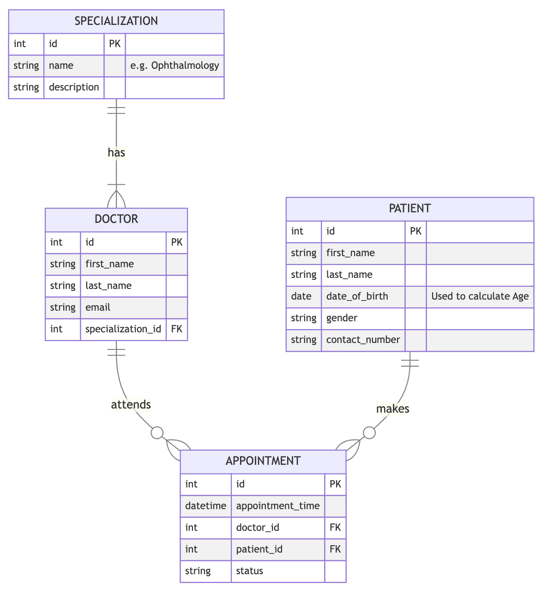
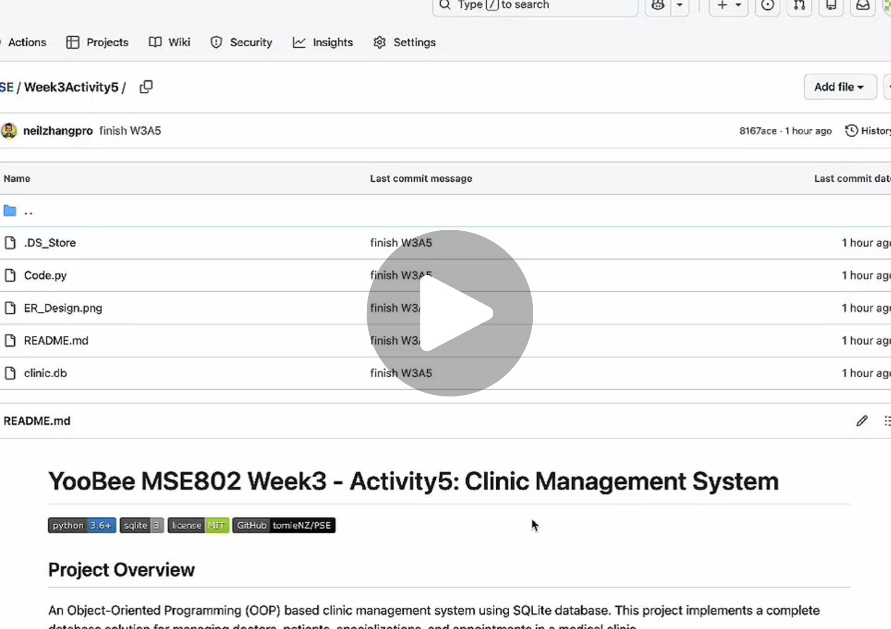

# YooBee MSE802 Week3 - Activity5: Clinic Management System


## Project Overview

An Object-Oriented Programming (OOP) based clinic management system using SQLite database. This project implements a complete database solution for managing doctors, patients, specializations, and appointments in a medical clinic.

## Objectives

- Design and implement an ER diagram for a clinic management system
- List all senior patients (age > 65 years) with their full information
- Display the total number of doctors specializing in ophthalmology
- Demonstrate OOP principles and database design patterns

## ER Diagram

The Entity-Relationship (ER) diagram illustrates the database schema design:



### Database Schema

The system consists of four main entities:

#### 1. Specialization
Stores medical specializations (e.g., Ophthalmology, Cardiology, Pediatrics).

#### 2. Doctor
Represents doctors with their specialization. Each doctor belongs to one specialization.

#### 3. Patient
Stores patient information including personal details and contact information.

#### 4. Appointment
Manages appointments linking doctors and patients with appointment details.

### Key Relationships

- **Doctor → Specialization**: Many-to-One (Many doctors can have the same specialization)
- **Appointment → Doctor**: Many-to-One (Many appointments can be with one doctor)
- **Appointment → Patient**: Many-to-One (Many appointments can be for one patient)

## Clinc Class

The `Clinc` class provides complete database management functionality:

### Core Methods

- `__init__(db_name: str)` - Initializes database connection and creates tables
- `create_tables()` - Creates all database tables with proper relationships
- `add_specialization(name: str, description: str)` - Adds a new medical specialization
- `add_doctor(first_name: str, last_name: str, specialization_id: int)` - Adds a new doctor
- `add_patient(first_name: str, last_name: str, date_of_birth: date, contact_number: str)` - Adds a new patient
- `list_senior_patients()` - Lists all patients over 65 years old
- `count_ophthalmologists()` - Counts doctors specializing in ophthalmology
- `delete_tables()` - Removes all tables (for testing purposes)

## Key Features

### Senior Patient Query
Uses SQL date functions to calculate age and filter patients born more than 65 years ago:
```sql
WHERE data_of_birth < DATE('now', '-65 years')
```

### JOIN Query for Specialization
Demonstrates relational database queries using JOIN to connect doctors with their specializations:
```sql
SELECT COUNT(*) FROM doctor 
JOIN specialization ON doctor.specialization_id = specialization.id
WHERE LOWER(specialization.name) = 'ophthalmology'
```

## Usage

```python
from Code import Clinc
from datetime import date

# Initialize the clinic database
db = Clinc('./clinic.db')

# Add specializations
db.add_specialization('Ophthalmology', 'Eye diseases specialist')
db.add_specialization('Cardiology', 'Heart diseases specialist')

# Add doctors
db.add_doctor('John', 'Doe', 1)  # specialization_id = 1

# Add patients
db.add_patient('Jane', 'Smith', date(1940, 1, 1), '1234567890')

# Query senior patients
db.list_senior_patients()

# Count ophthalmologists
db.count_ophthalmologists()
```

## Video of Record

[](https://customer-yba96prgaogr5aaa.cloudflarestream.com/6543c2f126fe9228c4be48e27267f9fb/watch)

## Requirements

- Python 3.6+
- SQLite3 (included in Python standard library)

No external dependencies required.

## Author

- **Author**: @tomiezhang
- **GitHub**: [https://github.com/tomieNZ](https://github.com/tomieNZ)

