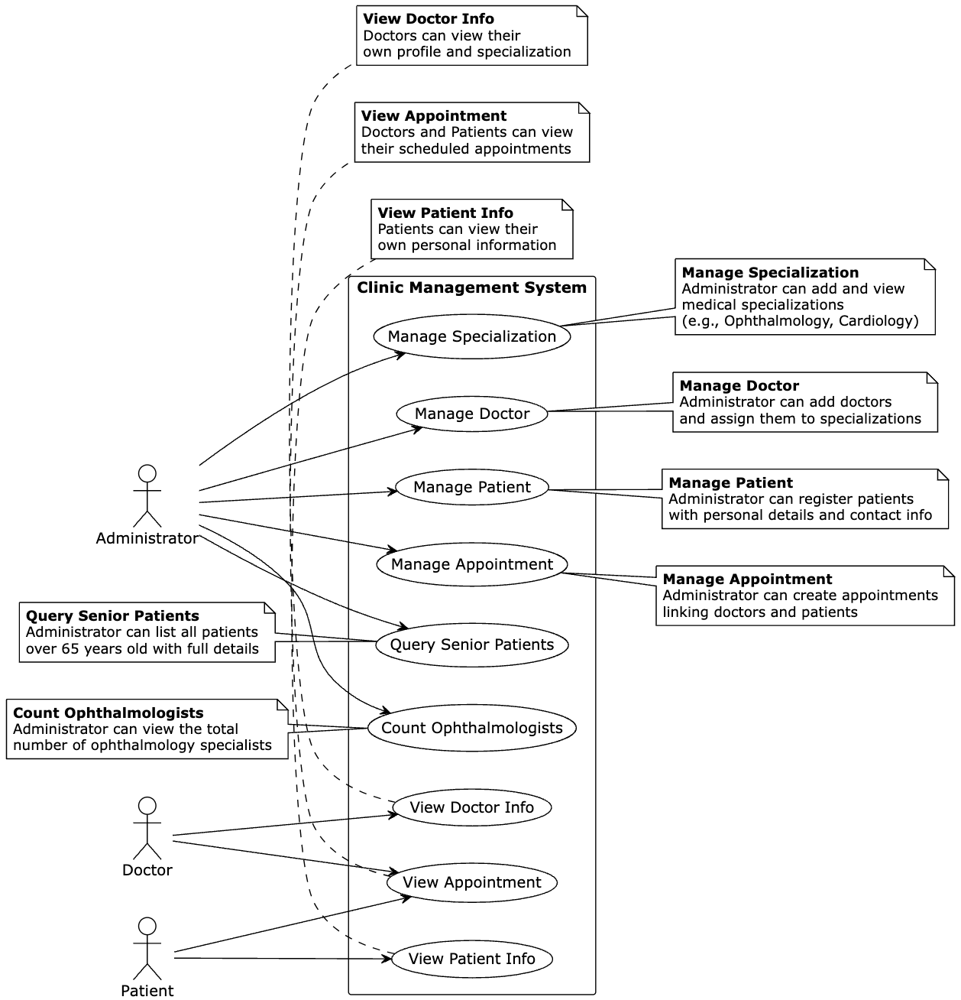

# Week 4- Activity 1: Usecase diagram
Explain a brief scenario for W3-A5, then design the corresponding use case diagram and share both here.

This diagram models a medical clinic system with three-tier access control (Admin/Doctor/Patient) supporting core operations of specialization management, doctor-patient registration, and appointment scheduling with business rule enforcement.

### User Case
